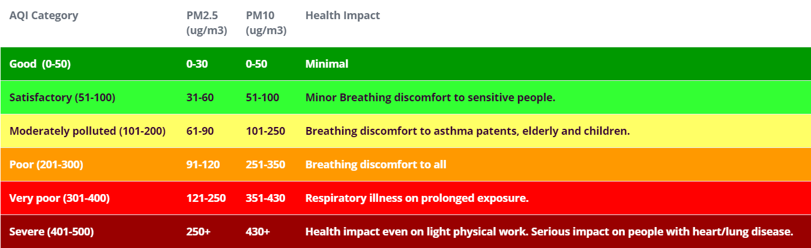

# pycom-plantower-pmsa003-aqi-sensor

### Web app frontend and backend
https://github.com/RobPruzan/React-Django-Skeleton-

Migrate with local_settings.py

    cd backend
    python3 manage.py migrate --settings=backend.local_settings

Run the backend server. With local_settings.py and port 8000 bind to all interfaces
https://stackoverflow.com/a/14545196/1303387

    cd backend
    python3 manage.py runserver 0.0.0.0:8000 --settings=backend.local_settings

Post AQI data to the backend

    curl -X POST -H "Content-Type: application/json" -d '{"pm1_0_concentration": 10.5, "pm2_5_concentration": 20.3, "pm10_concentration": 30.1}' http://localhost:8000/aqi

### Deployment
Clouds with free tiers:
https://github.com/cloudcommunity/Cloud-Free-Tier-Comparison

On Oracle free tier WM. Open ports for django server.

https://docs.oracle.com/en-us/iaas/developer-tutorials/tutorials/apache-on-ubuntu/01oci-ubuntu-apache-summary.htm

1. Create ingress rule for port 8000
2. Set up iptables

    sudo iptables -I INPUT 6 -m state --state NEW -p tcp --dport 8000 -j ACCEPT
    sudo netfilter-persistent save

### PMSA003 sensor

Arduino library

https://www.arduino.cc/reference/en/libraries/pms-library/

Micropython library

https://github.com/pkucmus/micropython-pms7003

### Nokia 5510 display

https://navody.dratek.cz/navody-k-produktum/lcd-displej-nokia-5110.html

https://www.youtube.com/watch?v=DehRWwvWFuo

